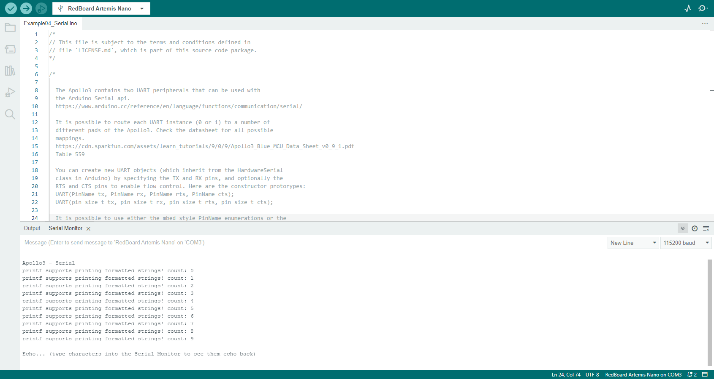

# Lab 1: The Artemis board

### Objective: Become familiar with both the Arduino IDE and the Artemis board using pre-packaged example code.

## Part 1: Hook the Artemis board up to your computer
For this part, I installed the Arduino IDE and necessary packages for the board, and ensured that the Artemis board connected to my computer and the IDE.

## Part 2: Example: Blink it Up
In this part, I ran the built in LED example in the IDE, which made the blue LED on the board periodically blink.

## Part 3: Example: Serial
In this part, I ran the built in serial example, which caused the board to output the numbers 0-9 in the serial, which I could view in the IDE.

## Part 4: Example: AnalogRead
In this part, I ran the built in analog read example, which takes an analog reading from the temperature sensor, and outputs a value based on this reading to the serial port.

<iframe src="https://drive.google.com/file/d/1oZet5PX1yTxCVF2LOignnDIvVuq9YNfd/preview" width="640" height="480" allow="autoplay"></iframe>
